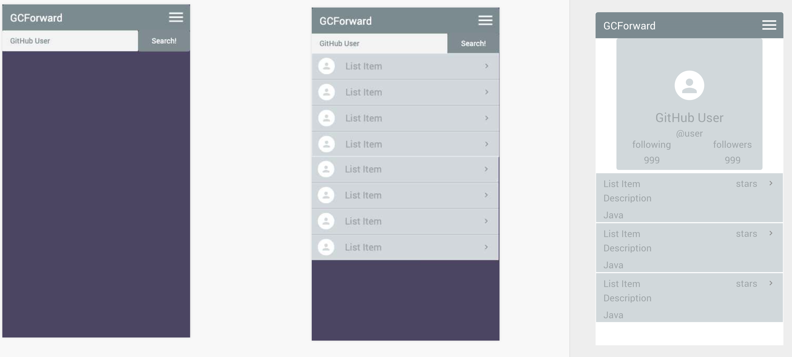
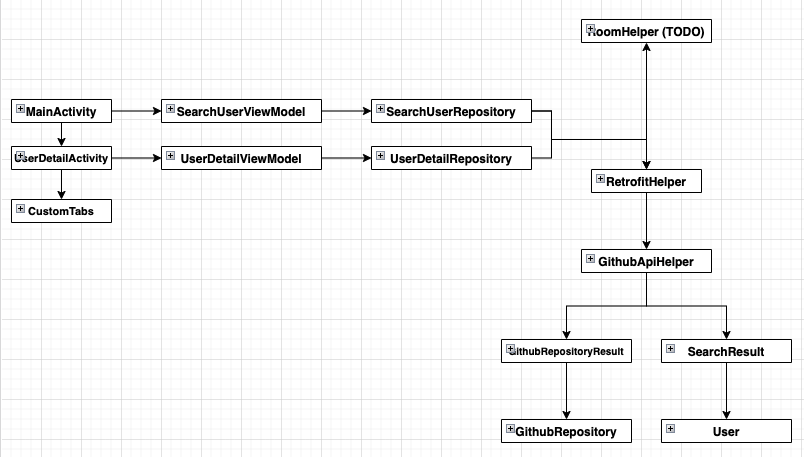

# GCForward-Android

A simple github client using kotlin.
The implementation of this application is using
* Kotlin
* Retrofit2
* Coroutines
* Espresso
* Simple MVVM

## UI Mockup
---
Simple UI is like below

## Classes
---
Simple class flow is like below

## How to build
---
1. To use this, Github personal access token is necessary
1. Set the key to key.properties file
1. Run the project
